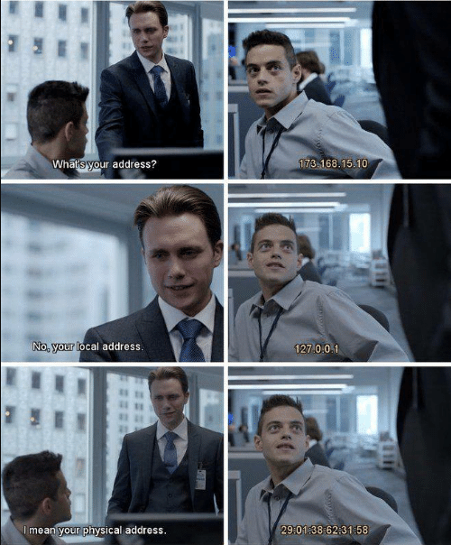
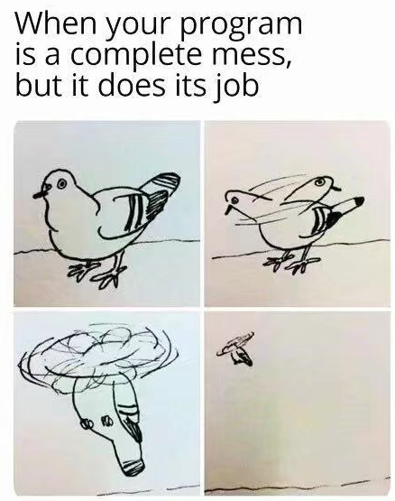
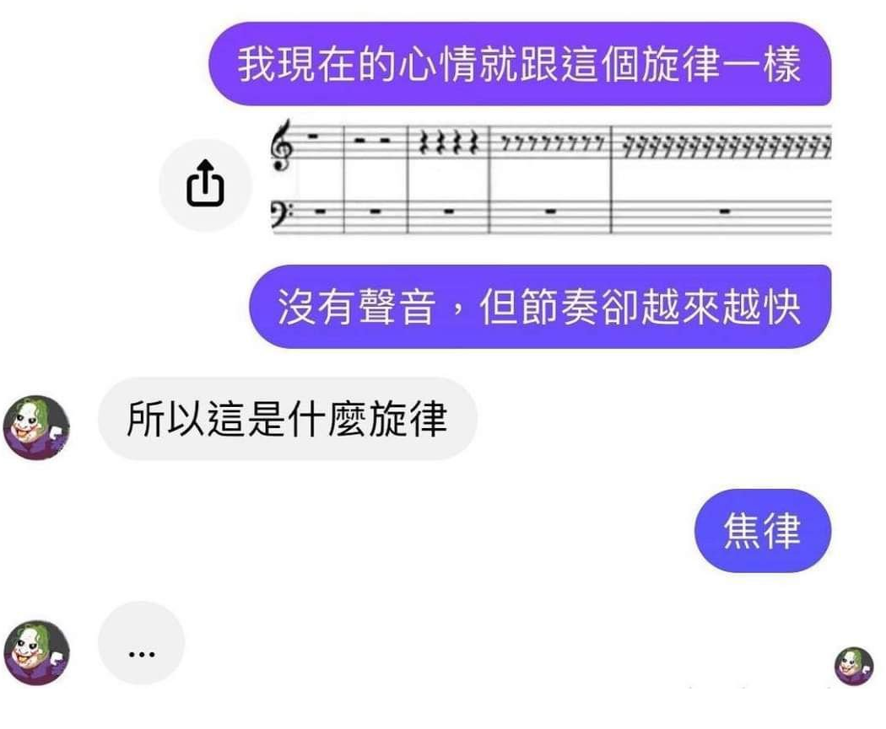

## **Sentences I wish to share**

[Inside Chinese internet, we some times called it "chicken soup" if some sentence or story is heuristic]

- *"Talk is cheap. Show me the code."* --- Linus Torvalds

- *"Talk is cheap. Show me the proof."* --- Qinxiang Cao

- *"Talk is not cheap"* --- Some Cyber-stranger

- *“闻道有先后，术业有专攻”*  --- 韩愈

  One might have learned the doctrine earlier than the other, or might be a master in his own special field. --- [Yu Han](https://en.wikipedia.org/wiki/Han_Yu)

- [Russell's Message](https://www.youtube.com/watch?v=ihaB8AFOhZo):

  - <iframe width="280" height="315" src="https://www.youtube.com/embed/ihaB8AFOhZo" title="YouTube video player" frameborder="0" allow="accelerometer; autoplay; clipboard-write; encrypted-media; gyroscope; picture-in-picture" allowfullscreen></iframe>

  - "*Ask yourself only what are the facts and what is the truth that the facts bear out*"

  - "*Never let yourself be diverted either by what you wish to believe or by what you think would have beneficent social effects if it were believed, but look only and solely at what are the facts.*"

  - "*Love is wise, hatred is foolish.*"

  

## **Current Future Plans**

- Learn more things in **Logics**, **Mathematics** and Computer Science (especially in **PL**, **Theory** and **System**);
- Raise a cat in 2 years (I will immediately raise one after passing my qualification examination, sincerely.)

## **Entertainment**

What I am excited about during leisure time:

- Sports:  Tennis = badminton > volleyball >> table tennis

- Animals (I do not have any pets...): cats, dogs, hamsters, ... (I really like [this couple's video](https://space.bilibili.com/4779198?from=search&seid=16222763425988580630&spm_id_from=333.337.0.0) 强烈推荐up主 *[九品芝麻铲屎官](https://space.bilibili.com/4779198?from=search&seid=16222763425988580630&spm_id_from=333.337.0.0)* 的视频剪辑)

- Movies: 

  - ***Interstellar (星际穿越)*** (the foremost one) [now you might know why I sometimes use "Intelstealer" as a nickname ...] [[YouTube](https://www.youtube.com/watch?v=uaSYEUugnzE), [Bilibili](https://www.bilibili.com/bangumi/play/ss28585/?from=search&seid=3596907034522347955&spm_id_from=333.337.0.0)]
  - ***The Dark Knight (黑暗骑士)*** [[YouTube](https://www.youtube.com/watch?v=B9wbHZM-L8g), [Bilibili](https://www.bilibili.com/bangumi/play/ss28280/?from=search&seid=15745780917256640498&spm_id_from=333.337.0.0)]
  - ***Big Fish (大鱼)*** [[YouTube](https://www.youtube.com/watch?v=mqIatIm6vlg), [Bilibili](https://www.bilibili.com/bangumi/play/ss33372/?from=search&seid=17356731908733314243&spm_id_from=333.337.0.0)]
  - [***Life in a Day***](https://www.youtube.com/watch?v=JaFVr_cJJIY) (a movie consistent of clips from all over the world in the same ordinary  day made by Youtube)
  - ***钢的琴 (The Piano in a Factory)***  [[Bilibili](https://www.bilibili.com/bangumi/play/ss12415/?from=search&seid=6574871034134810189&spm_id_from=333.337.0.0)]
  - ***Before Sunrise (爱在黎明破晓前)*** [[YouTube](https://www.youtube.com/watch?v=IqX_AZL8Sl0), [Bilibili](https://www.bilibili.com/bangumi/play/ss32312/?from=search&seid=6180111107384972910&spm_id_from=333.337.0.0)]
  - ***The Last Emperor (末代皇帝)*** [[Bilibili](https://www.bilibili.com/bangumi/play/ss34165/?from=search&seid=5971606446261401507&spm_id_from=333.337.0.0)]
  - ***World War Z*** (A good zombie movie; I like the design of its foreshadowing) [[YouTube](https://www.youtube.com/watch?v=PLYzc4K4a6o), [Bilibili](https://www.bilibili.com/bangumi/play/ss33173?from=search&seid=15745780917256640498&spm_id_from=333.337.0.0)]
  - ***Mad Max: Fury Road*** (I like the design of the post-apocalyptic world)
  - ***无人区 (No Man's Land)***
  - Movies from ***Marvel Cinematic Universe*** and ***DC Extended Universe***

- TV series: recalling ...

- Games: 

  - ***Red Dead Redemption 2*** (the favorite one)
  - ***Life is Strange***
  - ***Plants VS. Zombies***, ***Plant VS. Zombies 2***
  - ***Cytus II***, ***Deemo***, ***Lanota***  (all are music games)

- Instruments: Harmonica, (Piano, 10 years ago I can play it; now I can only love it)

- Music and Favorite Singers/bands:

  - Pop Music Singers/bands I was addicted to: 

    - Around 2019 ~ Now: *[Li Chen](https://music.apple.com/cn/artist/%E9%99%88%E7%B2%92/1138469250)* (95% of her albums and singles) and [Nightwish](https://www.nightwish.com/) (*Imaginaerum*, *Dark Passion Play* and *Endless Forms Most Beautiful* )
      - Have a taste: Updating ...
    - Around 2015 ~ 2018: *[Ellie Goulding](https://music.apple.com/us/artist/ellie-goulding/338264227)* (98% of her albums and singles) and  [*Bea Miller*](https://music.apple.com/us/artist/bea-miller/706171903) (*Fire N Gold*, etc.)
      - Have a taste: Updating ...
    - Around 2012 ~ 2015: *[Britney Spears](https://music.apple.com/us/artist/britney-spears/217005)* and [Kesha](https://music.apple.com/us/artist/kesha/334854763)
    - Around 2011: *Jay Chou*, *Michael Jackson*, *Song Xu*,  etc.

  - Classical Music (I was not an expert. In fact, I know nothing but just enjoy it.) :

    - *Sonata No.8 in C Minor, Op.13,  "Pathétique"*, I, II and III
    - *Sonata No.14 in C-Sharp Minor, Op. 27 No.2, "Moonlight"*, I , II and III
    - *Symphony No. 9 in E minor, Op. 95 "From the New World": IV. Allegro con fuoco*
    - *Fantaisie-Impromptu in C-Sharp Minor, Op. posth. 66*
    - *Nocturne No.2 in E Flat Major, Op.9, No.2*
    - *Serenade* by *Schubert* 
    - *VI. Waltz 2 from Jazz Suite No.2*
    - *Canon in D major* by *Pachelbel*
    - *"Modlitwa dziewicy" Op. 4 (A Maiden's Prayer)*
    - *Concerto No. 1 in E major, Op. 8, RV 269, "Spring"*
    - *Habanera from Carmen*
    - *Swan Lake, Op. 20a: No.1*

  - Traditional Chinese Music:

    - [*赛马*](https://www.youtube.com/watch?v=jitJGaoGs-I)

  - **Related to politics/patriotism** (I hate politics, but I love music):

    - *我的祖国 (My Homeland)*  \[ YouTube: [original version](https://www.youtube.com/watch?v=-pjriPXQC0o) from 1956; [a symphonic version](https://youtu.be/gL7am0SGO3s) \]

      This is a song that almost every one who came from China's mainland can sing	

    - *钢铁洪流进行曲 (March of Steel Torrent)* [[YouTube](https://www.youtube.com/watch?v=gFBwXdguRrY)]

      This is a new Chinese Military Song written in 2019

    - *La Marseillaise* (the national anthem of France; 中文译名*马赛曲*，法国国歌) [[YouTube](https://www.youtube.com/watch?v=SIxOl1EraXA)]

    - *Катюша (Katyusha, 喀秋莎)*

    - *Soviet March* (A joke song written by a US composer  苏维埃进行曲，美国作曲家编写的嘲讽苏联的歌曲😅) : D

  - From Movies & Games: **updating**

    - ***Interstellar:*** 
    - ***Plant VS Zombies:***
    - ***Plant VS Zombies 2:***
    - ***Red Dead Redemption 2:***
    - ***Life is Strange***
    - ***Cytus II & Deemo***
    - ***Les Misérables*:** *Look Down*, *At The End of The Day*, *The Docks (Lovely Ladies)*, *The Confrontation*, *Castle on a Cloud*, *Master of the House*, *Do You Hear The People Sing*
    - ***La La Land:***
    - ***Coco***: *Remember Me*, *Proud Corazón*
    - ***The Hanger Games:***
    - ***Sherlock Holmes:***
    - ***Suicide Squad:***
    - ***デジモンアドベンチャー (Digimon Adventure):*** *勝利〜善のテーマ〜*, *Butterfly*, *Brave Heart*
    - ***ウルトラマンティガ (Ultraman Tiga):***
    - ***Attack on Titan***:
    - ***Game of Thrones:***

  - Other songs I was addicted to and wish to share (categorized by language):

    - [Chinese] *千千厥歌 (Thousands of Songs)*, *认真地老去*, *杀死那个石家庄人*, *黑色也是值得被等待的*, *夜的第七章* , *下一站茶山刘*, *月牙湾*, *华阴老腔一声喊*, *万物生*
    - [English] *Five Hundred Miles*, *Hotel California*, *The Sound of Silence*, *Hedwig's Theme*, *New Year's Eve*, *Wake Me Up*, *Waiting For Love*, *Sparks Fly*, ...
    - [Japanese] *手紙〜拝啓 十五の君へ〜*, *夢灯籠*, *ぜんぜんぜんせ*, *PLANET*
    - [Russian] *Катюша (Katyusha)*, *Skoro dembel'*, *Подмосковные Вечера (Moscow Nights)* 
    - [Piano] *翘课 (skip class)*, *Flower Dance*, *风の住む街*, *城南花已开*
    - [Violin]
    - [Accordion]
    - [Computer Generated] *BASARA*
    - updating

  - Interesting songs (好玩的):

    - [*葫芦娃变奏曲*](https://www.bilibili.com/video/BV1r64y1B777?spm_id_from=333.999.0.0), [*喀 秋 杀* ](https://www.bilibili.com/video/BV1fE411W7Lw?share_source=copy_web)(唢呐)

- 

## **Some Cyber-friends :)**

- I am fortunate to know [Ziteng Wang](https://wzt.me/), who share the same spell of first name, similar spell of last name, and most importantly, the research interests in Programming Languages with me.
- I shared a similar game interest with [Zhiming Xu](https://zhiming-xu.github.io/), although we seem not to share similar research interests
- [Alex Chi](https://www.skyzh.dev/) is an undergraduate student (graduate at 2022)  from the department of Computer Science at SJTU; you might be interested in his (famous, somehow) programming skills and (famous, somehow) course grades
- [xxchan](https://xxchan.github.io/about/) used to be in the same research group with me during undergraduate time. His experience (see [this blog](https://xxchan.github.io/cs/2020/09/02/intern-at-meituan.html)) in an company might be a great reference for those (in China) who are still not sure whether going academical or industrial.  

## **Cooking**

To be updated when I became a master of that ...

# **Share Some Facts**

## "The Joke's On Me" - **Jokes in My Real Life**

- I usually mix up with "sophomore" and "semaphore" (This happens for at least 5 times ...)
- The first day I arrived at my undergraduate college, I need to configure the internet in my dormitory. Since I had never got in touch any concept about computer system yet, when they asked me to provide the MAC address, I mistook for that I must have a *Mac* from apple to earn the accessibility to the Internet.
- ...

## **Jokes/Meme (all from internet)**

- 

- "WHAT IS YOUR ADDRESS"

  

- “GIT PUSH”

  

- "TO BE OR NOT TO BE"

  

- “QED.”

  

- “IT WORKS”

  

  

- “WHO CARES”

  

- “VAN GOGHS”

  

- 

- 

- 

- ...

## **Computer Science in My Life**

- I was also admitted by the *Master of Logic* program at the University of Amsterdam. But not rich enough to enroll : (  [It requires around 10,000 for tuition and another 10,000 or maybe more for life expenses ...]
  - It doesn't mean I do not love Computer Science; they are somehow *[mutually inductive](https://en.wikipedia.org/wiki/Inductive_type#Mutually_inductive_definitions)* magics of the world 
- I gave up the desire of stepping into game design, another totally different career life at sophomore. This is mainly because I didn't found neither a good mentor/advisor nor ideal partners and didn't make it by self-study.
  - It doesn't mean I do not love Programming Languages. Instead, I found those two things in the area of Programming Languages later! 
  - Nevertheless, I always love the world of video games and believe they are a treasure of humans.
- I have no industrial experience till now. I still regard myself as **a very nonprofessional programmer**...
- Unlike a lot of my friends that started learning programming at a very young age, I never touched the world of computer science until freshman year at SJTU.

## **Life**

- I was born and raised up in *Chongqing*, China. This is a magical city built on several mountains. You should pay a visit if you'd like to see how such thing could exist. Besides, my father comes from *Hebei* Province in China and worked there in a small city named *Zhuozhou* for a very long time, which is only 1-hour-drive to *Beijing* . Therefore, I was also familiar with those cities. 
- Although I lived in Shanghai for 4 years during my undergraduate life, I know nothing about Shanghai at all because I spend most of my time on campus : (  The fact is, you will spend even less (a half) time to go to the downtown area in Shanghai from Hangzhou, Zhejiang Province than going there from Shanghai Jiao Tong University.
- ...

